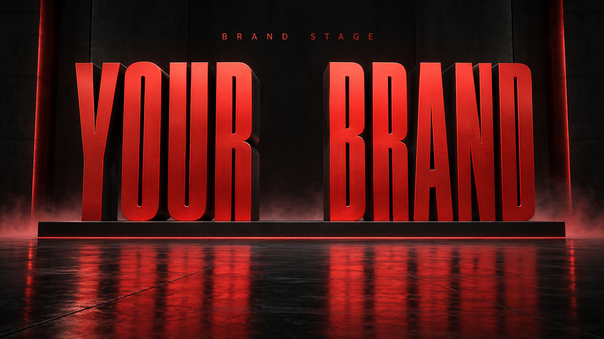

# Brand Stage Poster · 品牌舞台海报

[](https://github.com/JetQiao/brand-stage-poster/actions/workflows/test.yml)
[](LICENSE)

**一句话创建品牌舞台海报，让风格保持一致，让创意自由可控。**

巨型窄体字、克制的舞台空间、单一强调色与反射地面。适合品牌发布、团队亮相、活动主视觉，也支持修改已有海报和单独导出尺寸。



*AI 生成的无人物风格示例，文字为通用占位文案。不是品牌官方物料；[查看示例提示词](examples/preview-prompt.md)。*

这是遵循 `SKILL.md` 格式的开源 Skill，负责组织素材、提示词、修改范围和质量检查。**实际出图需要宿主提供图像生成／编辑能力**。没有生图工具时可输出提示词；安装 Skill 不会新增模型、服务额度或 API 密钥。

## 快速开始

在支持 Skill 安装的 Codex 环境中发送：

```text
$skill-installer 安装 https://github.com/JetQiao/brand-stage-poster 中的 Skill，入口在仓库根目录。
```

也可以手动安装到个人 Skill 目录：

```bash
mkdir -p ~/.agents/skills
git clone https://github.com/JetQiao/brand-stage-poster.git ~/.agents/skills/brand-stage-poster
```

安装完成后调用：

```text
$brand-stage-poster
做一张品牌舞台海报，左侧 NOVA，右侧 LAB，红黑配色，不要人物。
```

默认一张、横版 16:9、平衡自由度。需要真实团队时上传原始照片；需要现有品牌标志时上传 Logo。没有图形 Logo 可以只做文字品牌版。

也可放到项目的 `.agents/skills/brand-stage-poster/`。避免同时安装多份同名 Skill；若没有出现，重启宿主。安装位置与调用说明参考 [OpenAI 官方 Skill 文档](https://learn.chatgpt.com/docs/build-skills)。其他支持 Agent Skills 的宿主可读取本包，具体生图工具和安装方式以宿主为准，尚未逐一验证。

## 自由度与锁定

| 档位 | 自由度 | 适用场景 | 允许变化 |
| --- | --- | --- | --- |
| 严格 | 0–30 | 接近参考、系列物料 | 尽量保持排布、视角、比例和氛围 |
| 平衡，默认 | 31–70 | 日常创建、替换品牌 | 调整构图、景别、灯光与材质 |
| 探索 | 71–100 | 寻找新方向 | 更明显的空间与排布变化，保留风格特征 |

可以说“自由度 80”或“探索档”。数字是 Skill 的规则映射，不是模型参数、准确率或相似度百分比。

**锁定项独立于自由度**：指定文字、Logo 结构、人物外观与数量不会因为自由度提高而自动放开。你可以说“锁定人物和文字，其他大胆一点”，也可以指定配色、服装、画幅和视角。

## 常用场景

### 用自己的团队照片

```text
$brand-stage-poster
用上传的合照和 Logo 做品牌舞台海报，保持人数和左右顺序。
主字 NOVA LAB，冷蓝配色，两人统一黑色卫衣，自由度 50。
保留长相、眼镜、发型和原有胡须。
```

参考照片决定人物外观；风格参考决定构图和灯光。模型可能重绘脸部，生成后仍需对照确认；只有半身照时，新增的下半身是生成补全。

### 探索两个方向

```text
$brand-stage-poster
沿用这张海报，自由度 80，给两个构图方向。
锁定人物、Logo、文字和红黑配色，只放开空间、灯光与材质。
```

### 只改一处

```text
$brand-stage-poster
只把右侧文字改成 STUDIO，人物、衣服、Logo、颜色和构图保持。
```

### 只改输出尺寸

```text
$brand-stage-poster
不重新生成，把这张 PNG 保持比例导出长边 4096。
```

仅导出使用本地重采样，保留输入文件；不会重新生成脸部或补细节，也不将放大图标为原生 4K。

## 独立使用导出工具

只有本地尺寸导出需要 **Python 3.10+ 和 Pillow**；自然语言 Skill 本身不需要安装 Python 依赖。在仓库目录执行：

```bash
python3 -m venv .venv
source .venv/bin/activate
python -m pip install -r requirements.txt
python scripts/export_4k.py \
  --input /path/to/poster.png \
  --output-dir ./output \
  --prefix my-brand \
  --long-edge 4096
```

Windows 可使用 `py -m venv .venv`，随后在 PowerShell 执行 `.venv\Scripts\Activate.ps1`。

- 默认输出 `<prefix>_long-edge-4096.png` 和 `<prefix>_export.json`，横竖图都按长边缩放。
- 加 `--uhd`，额外生成 3840×2160 的 `<prefix>_uhd.png`，保持比例、居中加黑边，不裁切。
- 已有输出默认拒绝覆盖；`--overwrite` 允许替换输出，始终禁止覆盖输入文件。
- 使用 Lanczos 重采样；报告记录实际尺寸、是否缩放和留边。不是 AI 超分辨率。

## 包内结构

```text
SKILL.md                       代理执行入口
agents/openai.yaml             名称与默认调用示例
references/                    风格控制、制作流程、提示词与验收
scripts/export_4k.py            独立尺寸导出
assets/preview.png             无人物公开示例
examples/preview-prompt.md      示例的提示词与来源说明
tests/                         导出与包结构测试
```

生成任务的 brief、提示词、图片和检查记录放在任务输出目录。仓库不附带任何团队原照、私人品牌包或密钥；本地 `output/`、`private/` 和 `dist/` 默认被 Git 忽略。

## 验证与贡献

```bash
python -m pip install -r requirements-dev.txt
python -m unittest discover -s tests -v
```

自动测试验证导出行为、输入文件保护和包内引用；不会调用生图服务，也不替代视觉检查。真实生图效果取决于模型、素材和提示词，当前示例不能证明所有人物、品牌或自由度档位都稳定成功。

欢迎通过 Issue 提交可复现问题，或通过 PR 改进规则和脚本。反馈时附上宿主与工具、提示词、预期和实际结果；只提交有权公开的素材。修改脚本请运行测试，修改视觉规则请说明验证样例与仍存在的偏差。

## License

[MIT](LICENSE) © 2026 JetQiao。代码和文档按 MIT 协议开放；项目作者对仓库内 AI 示例图可许可的权益也按同一协议提供。第三方商标、肖像与用户自行提供的素材不属于本仓库的许可范围。
